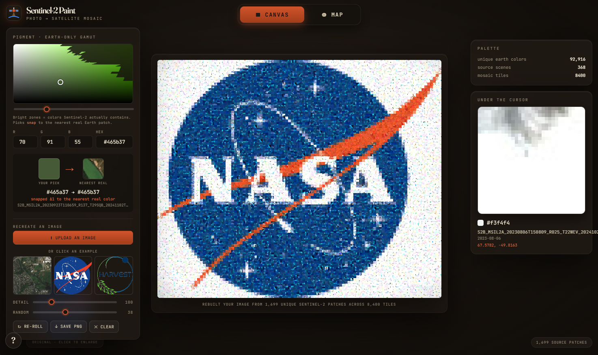
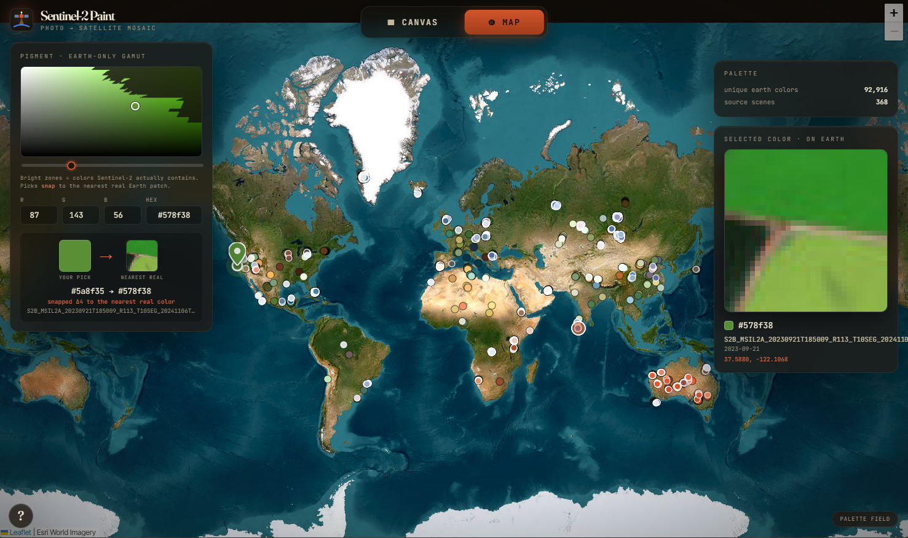

# sentinel2-paint — Paint with Sentinel-2

**Jump to: [Live site](https://calebrob.com/static/s2-paint/) | [Quick start](#quick-start) | [How it works](#how-it-works) | [The app](#the-app) | [Scripts](#scripts) | [Citation](#citation)**

Search the Sentinel-2 archive for 32×32 image patches, take the mean color of each patch, and keep one georeferenced thumbnail per unique (R,G,B) value. The result is a palette of real Earth colors, plus a single-page app that uses it two ways: pick a color and the globe flies to where Sentinel-2 saw it, or upload a photo and watch it rebuilt as a mosaic of real satellite patches. A harvest of ~370 curated and random Sentinel-2 scenes yields ~93k unique colors, each backed by a thumbnail and a lat/lon. Live demo: [calebrob.com/static/s2-paint](https://calebrob.com/static/s2-paint/).

<p align="center">
  
</p>

**Figure 1.** The *Canvas* tab of the [webapp](https://calebrob.com/static/s2-paint/). The NASA logo has been rebuilt from real Sentinel-2 patches, nearest color per cell; clicking a tile traces it back to its source scene and lat/lon.

<p align="center">
  
</p>

**Figure 2.** The *Map* tab of the [webapp](https://calebrob.com/static/s2-paint/), a Leaflet globe over Esri World Imagery showing where each palette color was sampled. Picking a color flies the globe to that spot. Only colors that occur in the imagery are selectable in the picker, and every pick snaps to the nearest real patch.

## Quick start

```bash
git clone https://github.com/calebrob6/sentinel2-paint.git
cd sentinel2-paint
pip install -r requirements.txt

# 1. tiny end-to-end demo (~2 windowed scenes) -> data_demo/
python demo.py

# 2. pack the demo palette into the web app -> web/
python build_web.py data_demo

# 3. serve it
cd web && python -m http.server 8745   # open http://localhost:8745
```

The demo reads only a 1024×1024 corner of two scenes, so it finishes in a few seconds and produces a small palette. For a full palette, run the exhaustive harvest below.

## How it works

1. **Sample** Sentinel-2 L2A scenes from the Microsoft Planetary Computer: a curated set of color-rich places and seasons (salt-evaporation ponds, tulip fields, deserts, glaciers, coral lagoons, autumn foliage, geothermal pools, red mine tailings), plus random global land sampling for the long tail.
2. **Download** each scene's 8-bit RGB `visual` COG.
3. **Grid** it into non-overlapping 32×32 patches (~117k per full 10980×10980 tile).
4. **Mean** each patch, then quantize to (R,G,B). Keep one thumbnail and geolocation per *unique* color (off-swath/nodata patches are dropped).
5. **Pack** the palette into sprite-atlas JPEGs plus a compact index for the web app.

The store is append-only, so a harvest can run for hours and resume at any time. Each unique color costs 3072 bytes on disk (`patches.bin`); metadata is one JSON line per color (`meta.jsonl`). You can rebuild `web/` and refresh the app at any point to watch the palette grow.

## The app

The webapp ([`web/index.html`](web/index.html)) is a single static HTML file with a shared color picker (saturation/value square, hue slider, R/G/B/hex fields) and two tabs. The picker only offers colors that occur in the imagery; the rest of the gamut is dimmed, and every pick snaps to the nearest real patch (the snap ΔRGB is shown).

- **Map** — a Leaflet globe over Esri World Imagery. Picking a color flies the globe to where Sentinel-2 saw it and drops a pin. A sample of the whole palette is scattered across the globe as colored dots; click one to grab that color.
- **Canvas** — upload a photo or click a built-in example and it is rebuilt as a mosaic of Sentinel-2 patches (nearest color per cell, computed with an async progress bar). *Detail* sets the mosaic resolution; *Random* mixes in patches within a bounded ΔRGB of the best match to break up repeated chips in flat areas; *Re-roll* reshuffles that choice without re-uploading; *Save PNG* exports the result. Clicking any tile flies the globe to where that patch came from.

## Scripts

### `harvest.py`

Exhaustive, resumable harvest: every curated color-rich target first, then endless random continental-land sampling to fill the long tail. Appends new unique colors to a `Palette` in `--data-dir`.

```bash
python harvest.py --data-dir data --minutes 360 --scenes 2000
```

| Flag | Description |
| --- | --- |
| `--data-dir` | Palette directory to append to (created if missing). Default `data`. |
| `--minutes` | Wall-clock budget before stopping. Default `720`. |
| `--scenes` | Max number of scenes to process. Default `100000`. |
| `--seed` | RNG seed for the random-sampling queue. Default `1`. |
| `--save-every` | Flush the store to disk every N scenes. Default `5`. |

### `build_web.py`

Packs a harvested palette into web assets: sprite-atlas JPEGs (`web/atlas_*.jpg`, 64 patches per row) plus a compact `web/colors.json` index (color → atlas coords + lon/lat + source scene).

```bash
python build_web.py data            # pack the full palette -> web/
python build_web.py data 80000      # cap to ~80k colors for browser performance
```

The optional second argument caps the palette via a **coverage-maximizing** downsample: it quantizes RGB at increasing resolution and keeps one color per occupied cell, so the colors most spread across the gamut survive (rare vivid colors are kept instead of being out-voted by dense regions).

### `demo.py`

Small end-to-end run (two windowed scenes → `data_demo/`) that exercises the full pipeline before committing to a long harvest. See [Quick start](#quick-start).

## Citation

If you use this repo, please cite it:

```bibtex
@misc{robinson2026sentinel2paint,
  author       = {Robinson, Caleb},
  title        = {{sentinel2-paint}: paint with {Sentinel-2}},
  year         = {2026},
  howpublished = {\url{https://github.com/calebrob6/sentinel2-paint}}
}
```

## License

MIT. See [`LICENSE`](LICENSE).
